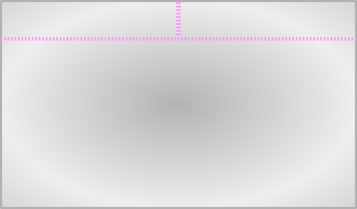

# Touchpad ThumbKeys
<h2 align="center">
  
</h2>

Touchpad ThumbKeys converts the top strip of your touchpad into configurable left/right zones that output single keys, combinations of keys, or commands.
Built with [Kanata](https://github.com/jtroo/kanata/) consumption in mind, but works just as well as a stand-alone tool.

## Configure

Before a full installation, configure the daemon:

1. Clone wherever you'd like: `git clone https://github.com/brandonbeaumia/touchpad-thumbkeys.git`
2. Run the script interactively: `sudo python3 touchpad-thumbkeys.py`
3. Place your fingers on home row and repeatedly tap your touchpad with each thumb. Note the X and Y coordinates that are reported.
4. Press `Ctrl+C` to exit.
5. Open `touchpad-thumbkeys.py` in your text editor and edit the thorougly-commented Configuration section to set up your zones, actions, and a few preferences.
6. Repeat steps 2-5 until it is behaving to your liking.


## Install (Optional)

After achieving your preferred settings, you may install the script and systemd service to run it automatically in the background. The service requests being started before other common input handling services (kanata, keyd, kmonad, input-plumber), but beware that the order matters for input grabbing so you may need to add your missing service to the `Before=` line of `touchpad-thumbkeys.service`.

```bash
cd ~/Downloads/touchpad-thumbkeys/
sudo install -m755 touchpad-thumbkeys.py /usr/local/bin/touchpad-thumbkeys.py
sudo install -m644 touchpad-thumbkeys.service /etc/systemd/system/
sudo systemctl daemon-reload
sudo systemctl enable --now touchpad-thumbkeys
```
Restart Kanata or other input handlers so they regrab the device. Only necessary this first time. Alternatively, reboot.

## Post-Install

* Viewing Logs: `journalctl -f -u touchpad-thumbkeys.service`
* Updating Config: edit `/usr/local/bin/touchpad-thumbkeys.py` and then restart via `sudo systemctl restart touchpad-thumbkeys.service`

## Uninstall
```bash
sudo systemctl disable --now touchpad-thumbkeys
sudo rm /usr/local/bin/touchpad-thumbkeys.py /etc/systemd/system/touchpad-thumbkeys.service
sudo systemctl daemon-reload
```


## Touchpad Conflict Mitigation

This is designed to not interfere with most regular touchpad movement:
*   Sliding into the thumb zones from below is passed through as regular cursor movement.
*   Sliding out of a thumb zone releases the synthetic key and begins touch pass-through.
*   If two fingers land in the same thumb zone (e.g., initiating a two-finger scroll near the top edge), keys are released and touch input is passed through.
*   (optional) Exclusive Key Mode: Any simultaneous left+right thumb zone enablement releases the keys and begins pass-through (cross-zone version of the same-zone cancellation above).
*   (optional) Hold Time Delay: Require that a finger remain in a thumb zone for at least a number of milliseconds before its action is outputted.
